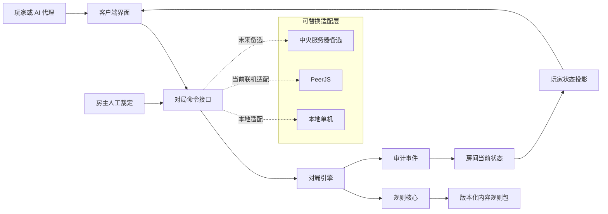

# FD 游戏规则与对局引擎架构提案

> 状态：供项目作者与参与者评审。本文汇总截至 2026-08-30 已确认的规则执行与软件架构设计；“备选方案”不代表已经定案。

## 提案摘要

本提案建议保留现有项目的卡牌数据、图片、地图布局和主要操作流程，逐步将规则判断、角色能力、对局状态与界面操作分离。目标不是让系统替真人玩家出牌，而是让玩家自行决策、系统统一判断是否合法并可靠结算。

推荐的核心形态为：

```text
通用阶段状态机
+ 确定性规则引擎
+ 结构化角色能力
+ 少量专属处理器
+ 房主人工裁定兜底
```

运行中的对局不调用大语言模型。AI 只在开发阶段辅助分析能力文本、发现与通则的冲突、生成候选结构和测试场景；可执行规则必须经过开发者确认。

## 设计原则

1. **玩家做策略选择，系统裁定规则。** `FULL` 代表规则完全受支持，不代表系统替真人玩家操作。
2. **状态机管理流程，规则引擎计算权限。** 角色例外不写成散落在主流程中的大量条件分支。
3. **能力只修改其明确涉及的规则维度。** 允许技能牌暗置，不自动意味着免费、任意时点或不计入出牌数量。
4. **运行时确定、可重放。** 同一规则包、随机种子与事件序列应得到相同结果。
5. **隐藏信息按玩家投影。** 客户端只获得自己有权查看的内容。
6. **先覆盖通则和少量代表角色。** 未结构化能力使用房主裁定保障，不阻塞初版开发。

## 目标架构



建议的模块边界：

| 模块 | 职责 |
| --- | --- |
| `content` | 御主、从者、卡牌、结构化能力、规则包版本 |
| `rules-core` | 通则、合法性查询、效果组件、费用、优先级、纯状态转换 |
| `match-engine` | 阶段状态机、命令、决策窗口、事件队列、人工裁定、快照 |
| `projection` | 玩家私有视图、公共桌面视图、代理视图 |
| `transport` | 本地、PeerJS 或未来 WebSocket/服务器适配 |
| `client-ui` | 桌面展示、出牌选择、能力提示、裁定面板和日志 |

依赖方向保持单向：

```text
界面 → 对局接口 → 对局引擎 → 规则核心 → 内容定义
```

界面不得直接修改对局状态；能力处理器也不得直接操作 DOM。

## 对局流程与能力时点

状态机采用较粗粒度的阶段与个人回合，不为普通能力建立大量微型响应窗口：

```text
准备阶段
→ 前哨阶段各玩家回合
→ 行动阶段各玩家回合
→ 战斗阶段各玩家回合
→ 战力及效果结算
→ 回合结束
```

玩家行动回合通常按以下顺序进行：

```text
决定常规移动或不移动
→ 同时完成常规出牌与支付
→ 使用当前满足条件的行动阶段能力
→ 确认结束个人行动回合
```

- 常规移动决定必须先于常规出牌；选择不移动也视为已经完成移动决定。
- 不依赖卡牌激活的御主、从者、被动或阶段能力，可在本人对应阶段的个人回合内选择合法时机。
- 印在攻击牌或技能牌上的普通阶段能力，通常从该牌明置激活后开始可用。
- 能力不得插入“同时打出两张并统一支付”等尚未完成的原子操作。
- 阶段能力默认可选，只能在该玩家本阶段的个人回合中发动；个人回合结束后不能补发。
- `被动：`默认自动且强制适用。
- “当／每当／若……时”的事件触发能力，没有“可以”时默认强制；写有“可以”时由玩家选择。
- 不建立通用自由响应栈。需要其他玩家决策时，由效果显式创建决策窗口，完成后恢复原流程。

同时效果继续遵循既定顺序：局势牌优先于事件牌，事件牌优先于玩家卡牌；玩家卡牌再按回合顺位，同一玩家内部由该玩家决定顺序。

## 出牌与决策模型

常规情况下，玩家从三张手牌和三张技能牌中自行选择两张。系统只生成合法选项并校验：

- 来源区域、数量、朝向和目标；
- 技能牌通常要求在开始该次出牌前拥有至少 8 点魔力，以及角色是否具有例外；
- 手牌不足时是否已经按规则全部纳入；
- 战场上是否至少明置一张；
- 同一批明置牌总费用能否同时支付；
- 特殊效果是否改变数量、费用、区域或时点。

追加攻击、效果要求打牌、跨阶段打牌和延迟激活使用统一决策请求，并记录：

```text
行动者、选择者、来源区域、数量、是否强制、是否计入常规两张、
明暗规则、费用规则、目标、可见性、回退策略和流程恢复点
```

未特别说明时：

- “打出一张牌”默认明置并正常支付魔力。
- “令某玩家打出或展示”默认由该玩家选择。
- 只有文本明确授权时，发动者才能查看或选择其他玩家的隐藏牌。

多人同时选择、展示或打出时采用密封提交：各玩家独立选择并锁定，其他人只能看到完成状态；全员锁定后统一公开并按规则顺序结算。公开前可撤销锁定，公开后视为已产生新信息。

## 明置、暗置与延迟激活

普通暗置打出的牌仍视为被打出和使用，但不激活、不支付魔力、不计算威力，并通常在回合结束时进入弃牌堆。技能牌通常不能暗置，具体角色能力可以改变这一规则。

允许暗置后延迟激活的能力必须明确记录：

```text
支付时点：暗置时 / 激活时 / 免费 / 替代支付
支付数额：牌面费用 / 固定数值 / 修正后数值
激活阶段与条件
支付凭证
未激活时的去向
```

- 不统一假定延迟激活一定在激活时付款，必须按具体从者或卡牌文本分析。
- 暗置时已经支付的魔力默认不退，也不会在激活时重复扣除。
- 未激活、放弃激活、条件失效或卡牌被移除均不自动返还；只有文本明确规定时才返还。
- 文本未明确费用语义时，不得标记为 `FULL`，应进入人工确认或人工裁定。

## 规则组件与专属处理器

常见能力优先由有限组件组合：

- 许可、禁止和前置条件修改；
- 费用增减、替代、支付时点和返还；
- 出牌数量与来源区域修改；
- 明置、暗置和延迟激活；
- 跨阶段使用许可；
- 数值修正、持续效果和替代效果；
- 事件触发、被动效果和临时决策窗口；
- 要求玩家展示、打出、选择或指定目标。

真正无法合理组合的能力使用专属处理器。专属处理器仍须通过统一接口读取状态、请求决策和提交状态变化，不能绕开卡牌唯一性、权限验证、费用原子性等底层约束。

运行时按事件建立索引。例如发生 `CARD_PLAY_REQUESTED` 时，只加载与本次打牌、当前角色、地点和持续效果有关的规则，不扫描全部角色和卡牌。房间只保存动态状态和规则 ID，所有房间共享不可变规则包。

五级效果优先级仅用于同一规则维度发生冲突时；不同维度的规则不互相吞并。

## 玩家区域与隐藏信息

玩家状态以最终规则文档为准，不以当前页面布局反推规则。标准区域包括：

- 御主能力及专属组件区；
- 魔力、令咒、VP 与棋盘位置；
- 暗置从者概览牌；
- 个人攻击牌库；
- 手牌区；
- 三张技能牌所在的技能区；
- 攻击区；
- 弃牌堆；
- 移出游戏区；
- 残留、临时攻击、延迟激活和持续效果记录。

卡牌所在区域与展示状态分别保存。同在攻击区的牌仍需区分明暗、是否激活、是否计算威力、是否已支付、是否残留、是否为临时攻击和是否等待延迟激活。

可见性规则：

- 玩家可查看自己的手牌、暗置牌、技能牌、从者概览牌和弃牌堆。
- 弃牌堆完整内容仅所有者可查看；其他玩家只能看到允许公开的数量或历史事件。
- 对手只获得牌数、公开牌和规则明确允许公开的信息。
- 暗置牌的被动实际影响游戏时，才按规则展示并执行。
- 技能牌关闭后返回技能区；非技能牌按弃牌或移出游戏规则处理。

## 角色支持等级与人工裁定

规则支持等级与玩家控制方式相互独立：

```text
规则支持：FULL / PARTIAL / MANUAL / DISABLED
控制方式：HUMAN / AI_PROXY
```

| 等级 | 含义 |
| --- | --- |
| `FULL` | 全部能力已结构化、测试并可由系统裁定；策略仍由玩家选择 |
| `PARTIAL` | 部分能力自动裁定，指定能力由房主裁定 |
| `MANUAL` | 系统维护基础状态，主要特殊能力由房主裁定 |
| `DISABLED` | 关键语义未确认，不允许进入正常对局 |

人工裁定流程：

```text
系统在安全点暂停
→ 展示能力原文和相关合法信息
→ 房主通过受限操作提交裁定
→ 系统检查底层一致性
→ 写入公开裁定日志
→ 恢复原流程
```

房主拥有最终裁定权，但不能任意修改整个状态。可提供调整数值、移动指定卡牌、创建临时效果、指定目标、追加或跳过指定行动等受限操作。

不设置会自动出牌、跳过或判负的硬性倒计时。玩家在线时，房主代理操作必须取得本人同意；玩家断线或无法回应时，房主可临时接管。代理默认只覆盖当前决策窗口，访问的私有信息和所有操作都必须记录。

## 确认、回退与纠错

- 最终确认前，玩家选择只作为草稿，可自由修改。
- 确认后尚未公开新信息或触发其他玩家决策时，可申请房主批准撤回。
- 抽牌、展示、随机判定、其他玩家决策或后续结算开始后，禁止普通回退。
- 规则错误只能由房主提交人工纠错事件；原事件不删除，审计链保持完整。

## 状态、事件与存档

推荐采用“当前状态 + 审计事件 + 周期快照”，不要求初版实现完整事件溯源。

房间状态至少包含：

```text
规则版本、随机种子、回合、阶段、个人回合、七个席位、
卡牌实例及区域、魔力、战力、位置、持续效果、使用次数、
支付凭证、决策栈、代理状态、人工裁定状态、状态版本号
```

玩家提交命令，系统校验后产生事件，再由事件更新状态。失败命令不改变任何状态；已接受事件代表已经发生的事实。

存档绑定开局使用的不可变规则包版本。恢复时加载最近快照并重放其后的少量事件；后续发布的新规则不会改变进行中或已归档对局的解释。

## 内容录入与发布

内容处理流程：

```text
原始能力文本
→ AI 辅助冲突分析与候选结构
→ 开发者确认
→ 结构化能力定义
→ 测试场景
→ 审核支持等级
→ 发布不可变规则包
```

每项能力记录来源、阶段、触发事件、激活要求、可选性、费用、区域、目标、次数、持续时间、修改维度、使用组件或处理器、支持等级和已通过测试。

只有全部能力经过结构校验、场景验证、隐藏信息验证、回放验证和人工审核后，角色才能标记为 `FULL`。

## 测试与验收门槛

测试至少分为五层：

1. **规则包校验：** ID、引用、阶段、区域、费用、事件和处理器完整性。
2. **通则单元测试：** 七人席位、移动、常规出牌、手牌不足、明暗置、技能牌、令咒、优先级和回合清理。
3. **角色场景测试：** 正常、条件不足、通则冲突、禁止效果、费用边界、隐藏信息和回合结束。
4. **不变量与模拟：** 卡牌区域唯一、费用不重复、权限正确、密封内容不泄露、流程不死锁。
5. **确定性回放：** 相同规则包、随机种子和事件序列得到相同最终状态。

可用固定策略代理批量运行七人局来发现状态错误，但初期不以此评估角色平衡。

## 当前代码证据与渐进路径

当前代码已经具备可复用资产，但规则、状态和界面的边界较弱：

| Evidence | Finding | Path |
| --- | --- | --- |
| `index.html` 同时加载数据、`SkillLib.js`、PeerJS，并直接通过 `Engine.*` 处理大量按钮操作 | 页面承担了界面、流程和联机入口等多种职责 | 保留页面表现，先让操作改为提交统一命令 |
| `SkillLib.js` 中能力直接调用 `Engine` 并修改 `State` 或玩家对象 | 角色能力与全局实现耦合，难以独立验证和回放 | 先抽取通用效果组件，再为少数特殊能力保留受控处理器 |
| `data_core.js` 与多个 `data_*.js` 通过全局对象组合内容 | 数据可复用，但缺少结构校验、版本和支持等级 | 建立版本化内容规则包并在构建期校验 |
| PeerJS 由页面直接加载 | 当前联机方式可以作为初期适配器，但不应侵入规则核心 | 抽象 `transport`，保留中央服务器方案作为备选 |

建议采用渐进替换，而不是一次性重写：

```text
建立命令与状态边界
→ 抽取纯规则类型和合法性查询
→ 迁移移动与常规出牌
→ 迁移阶段能力和决策窗口
→ 接入少量代表角色
→ 增加人工裁定保障
→ 用回放和场景测试逐步替换旧分支
```

每迁移一项机制，都应保持旧界面可运行；新实现通过固定场景验证后，再删除对应旧逻辑。

## 已确认与备选事项

已确认：

- 玩家选择、系统裁定的职责边界；
- 粗粒度阶段状态机；
- 规则组件与专属处理器混合；
- 事件索引与按需合法性查询；
- `FULL / PARTIAL / MANUAL / DISABLED`；
- 房主最终裁定、代理授权、密封提交和回退边界；
- 当前状态、审计事件和周期快照；
- 内容人工审核、不可变规则版本及 `FULL` 测试门槛；
- 弃牌堆完整内容仅所有者可查看；
- 渐进式模块重构，网络层保持可替换。

备选、尚未定案：

- PeerJS 房主权威与中央权威服务器之间的最终选择；
- 是否将当前仓库直接演进为 TypeScript 工作区，或先通过构建产物接入；
- 首批完整自动化的御主、从者和卡牌范围；
- 正式竞技模式、独立裁判、观战、账号体系和大规模部署。

## 建议的评审结论

本次评审无需一次决定所有网络和部署问题。优先确认以下不可逆程度较高、且与网络实现无关的边界：

1. 界面不能直接修改权威状态；
2. 玩家操作统一转为命令，规则结果统一转为事件；
3. 角色能力不得继续无限扩张为主流程分支；
4. 隐藏信息必须通过玩家状态投影控制；
5. 未结构化角色必须有明确支持等级和人工裁定路径；
6. 每个正式支持的能力必须有可重复的规则场景测试。

这些边界确认后，可以先迁移移动、常规出牌、明暗置、费用和阶段能力，再决定最终联机权威方案。
