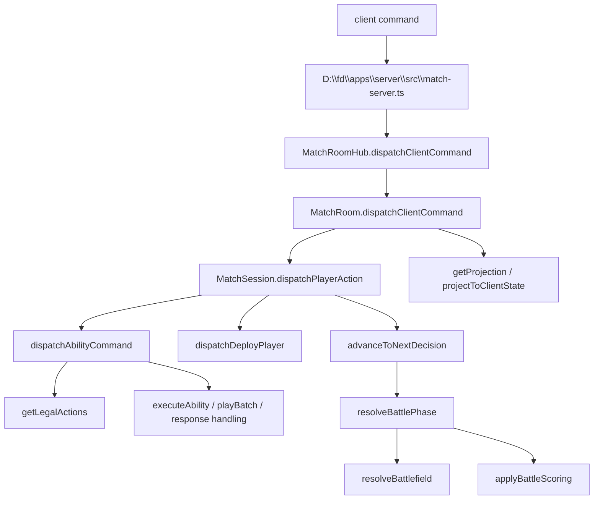
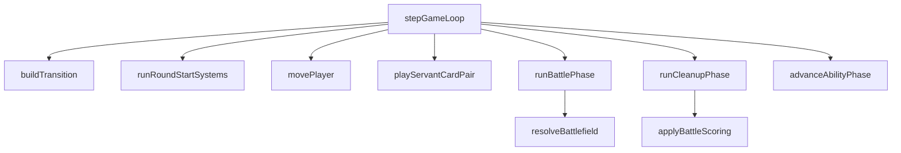

# FD Flow Runtime Inventory

审计日期：2026-09-07  
项目路径：`D:\fd`  
审计范围：当前 Flow Runtime、GameState/FlowState、阶段推进、行动流程、移动/出牌/能力/战斗/同步链路。  
约束：本轮只做事实梳理；未修改生产代码；未启动 Flow Engine 重构；未从文件名或文档单独推断实现。

## 1. Executive Summary

当前项目实际存在两条主要运行路径：

- 产品/联机路径：`D:\fd\packages\rules\src\match-session.ts` 的 `MatchSession`，由 `D:\fd\packages\rules\src\match-room.ts` 和 `D:\fd\apps\server\src\match-server.ts` 暴露给客户端。
- 较旧 core 路径：`D:\fd\packages\rules\src\core\game-loop.ts` 的 `stepGameLoop`，仍调用 `movePlayer`、`playServantCardPair`、`resolveBattlefield`、`applyBattleScoring`。

核心发现：

- 当前没有独立 `FlowState` 类型。全局阶段只由 `GameState.round.activePhase` 与 `GameState.round.prioritySeat` 表示，见 `D:\fd\packages\rules\src\schema\game.ts` 的 `RoundState`。
- 产品路径能按玩家座位依次推进 `preparation -> advance -> action -> battle -> round_end`，但行动阶段没有结构化记录“行动能力窗口 1 -> 常规移动 -> 行动能力窗口 2 -> 常规出牌批次 -> 行动能力窗口 3”的子状态。
- 当前产品路径没有普通 `move` 命令；产品交互命令有 `deploy_player`、`play_card`、`stage_attack_card`、`confirm_staged_attack`、`activate_ability` 等，见 `D:\fd\packages\rules\src\ability\types.ts` 的 `AbilityCommand`。
- 能力窗口、响应窗口、pending decision 已有可保存状态，但它们属于 `abilityRuntime`，未形成覆盖完整回合流程的 Flow Runtime。
- 战斗结算有实际管线，但仍有规则逻辑和具体卡牌逻辑混杂，例如 `return_silence`、`basic.luck`、`basic.preparation` 在 `D:\fd\packages\rules\src\core\combat-resolver.ts` 内被直接识别。
- 联机同步是服务器权威模型，`MatchRoomHub` 提供房间版本号，`abilityRuntime.revision` 提供能力视图 revision；但客户端命令未携带 expected revision，未见显式 stale command 拒绝机制。

## 2. Current Flow Architecture

### 产品路径

入口与证据：

- `D:\fd\packages\rules\src\match-room.ts` 的 `MatchRoom.startMatch` 创建并持有 `MatchSession`。
- `D:\fd\packages\rules\src\match-room.ts` 的 `MatchRoom.dispatchClientCommand` 调用 `session.dispatchPlayerAction(...)`，再调用 `runUntilHumanInputOrRoundEnd()`。
- `D:\fd\apps\server\src\match-server.ts` 通过 HTTP/WebSocket 包装 `MatchRoomHub`，并广播投影。

当前产品路径的权威对象是 `MatchSession.state: GameState`，阶段推进由 `MatchSession.advanceToNextDecision`、`MatchSession.runUntilHumanInputOrRoundEnd`、`MatchSession.resolveBattlePhase` 共同完成。

### Core 路径

入口与证据：

- `D:\fd\packages\rules\src\core\game-loop.ts` 的 `stepGameLoop` 使用 `buildTransition(state.round.activePhase)` 进行阶段转换。
- 同文件在 action 阶段仅识别 `input.action.type === "move"` 或 `"play"`，分别调用 `movePlayer` 或 `playServantCardPair`。

该路径可作为已有规则能力来源保留，但不是当前联机产品的唯一流程入口。

## 3. 实际 Runtime Call Graph

产品路径调用图：

具体证据：

- `D:\fd\packages\rules\src\match-session.ts` 的 `dispatchPlayerAction`：`deploy_player` 走 `dispatchDeployPlayer`，其他命令走 `dispatchAbilityCommand`。
- `D:\fd\packages\rules\src\ability\interpreter.ts` 的 `dispatchAbilityCommand`：克隆 `GameState`，调用内部 `dispatch`，成功后 `runtime(copy).revision++` 并 `Object.assign(s, copy)`。
- `D:\fd\packages\rules\src\match-session.ts` 的 `advanceToNextDecision`：交互阶段尝试 `advanceToNextActiveSeat`，没有下一座位时切换阶段或调用 `resolveBattlePhase`。
- `D:\fd\packages\rules\src\match-session.ts` 的 `resolveBattlePhase`：遍历战场，调用 `resolveBattlefield`，最后调用 `applyBattleScoring`、`advanceAbilityPhase(cleanup)`、`discardRoundSituationAndEvents`、`advanceAbilityPhase(round_end)`。

Core 路径调用图：

## 4. Current GameState / FlowState schema

不存在单独 `FlowState` 类型。已验证的状态结构：

- `D:\fd\packages\rules\src\schema\game.ts` 的 `phaseNames` 定义：`round_start`、`preparation`、`advance`、`action`、`battle`、`cleanup`、`round_end`。
- `D:\fd\packages\rules\src\schema\game.ts` 的 `RoundState` 仅包含 `roundNumber`、`activePhase`、`prioritySeat`。
- `D:\fd\packages\rules\src\schema\game.ts` 的 `GameState` 包含 `players`、`round`、`map`、`locationConfig`、`cards`、事件/局势、`battleResults`、`ruleOverrides`、`effectStack`、`log`，以及可选 `abilityRuntime`。
- `D:\fd\packages\rules\src\ability\types.ts` 的 `AbilityRuntime` 包含 `revision`、`sequence`、`cardState`、`ongoingEffects`、`responseWindows`、`pendingDecision`、`usedAbilities`、`processedEvents`、`hostRequests`、`movementDistanceThisRound`、`battlefieldsPassedOrStayedThisRound`、`playCounters`。

结论：

- 有阶段与优先座位状态。
- 有能力运行时状态。
- 没有覆盖“回合/阶段/玩家子步骤/窗口/动作配额”的统一 FlowState。

## 5. Round / Phase state machine

产品路径实际阶段：

- `D:\fd\packages\rules\src\match-session.ts` 的 `interactivePhases` 是 `preparation`、`advance`、`action`、`battle`。
- `MatchSession.startRound` 把回合设置为 `{ roundNumber, activePhase: 'preparation', prioritySeat: 1 }`，并调用 `advanceAbilityPhase(..., 'preparation')`。
- `MatchSession.advanceToNextDecision` 在玩家座位用完后：
  - `preparation` 转 `advance`。
  - `advance` 转 `action`。
  - `action` 或 `battle` 调用 `resolveBattlePhase`。
- `MatchSession.resolveBattlePhase` 会先确保进入 `battle`，然后战斗、计分、清理并进入 `round_end`。
- `MatchSession.runFullMatch` 在 `round_end` 后递增 `roundNumber` 并调用 `startRound`。

Core 路径实际阶段：

- `D:\fd\packages\rules\src\core\phase-machine.ts` 的 `phaseOrder` 是 `round_start -> preparation -> advance -> action -> battle -> cleanup -> round_end`。
- `D:\fd\packages\rules\src\core\game-loop.ts` 的 `stepGameLoop` 每次调用 `buildTransition` 前进一步。

与规则基线对齐情况：

- `D:\fd\docs\rules\FD-Game-Rules-Final.md` 第 6 节规定流程为回合开始、准备、前哨、行动、战斗、战力结算、回合结束、淘汰/最终胜负。
- 产品代码中的 `advance` 对应规则文档中的“前哨阶段”，命名差异需要在后续整合中保留映射或统一术语。
- 产品路径把战斗阶段玩家窗口和战力结算压在 `resolveBattlePhase` 周边，缺少独立、可查询的 `combat_resolution` / `scoring` 子状态。

## 6. Action Phase sub-state machine

规则基线：

- `D:\fd\docs\rules\FD-Game-Rules-Final.md` 第 9 节规定每名玩家行动回合顺序：行动阶段能力、一次常规移动、行动阶段能力、常规出牌、行动阶段能力。
- 同节规定常规移动必须发生在常规出牌之前，且不能插入同时支付或同时出牌批次。

当前实现：

- `D:\fd\packages\rules\src\ability\types.ts` 的 `LegalAction` 已新增 scoped `normal_move` / `pass_move` action。
- `D:\fd\packages\rules\src\ability\interpreter.ts` 在 `modeState.strictActionFlow === true` 时通过 `AbilityRuntime.actionTurn` 暴露 Action Phase 子步骤：`before_move_ability_window`、`normal_move_or_pass`、`after_move_ability_window`、`play_batch`、`after_play_ability_window`。
- `D:\fd\packages\rules\src\match-session.ts` 的 `passPriority` 在 strict flow 下不直接结束玩家 decision，而是先推进行动阶段窗口；在 play step 如果仍有 legal playable hand card，则以 `play_required` fail-closed。普通出牌义务按手牌计算：0 张可 pass，1 张可确认 1 张，2 张及以上必须 staged 满 2 张普通手牌攻击再确认；技能区卡牌不计入普通手牌出牌义务。
- `D:\fd\packages\rules\src\core\game-loop.ts` 的 `stepGameLoop` 有 action 阶段 `move` 和 `play` input，但该路径按 phase transition 处理，不是产品联机路径的子状态机。

结论：

- Golden Flow 1 范围内已经存在结构化 Action Phase sub-state machine candidate。
- “常规移动已执行/跳过”、“常规手牌出牌批次已执行/跳过”、“当前处于第几个行动能力窗口”在 strict flow 中由 `AbilityRuntime.actionTurn` 持有。
- 该能力仍是 scoped transitional owner；未启用 strict flow 的旧 action-phase 路径仍可同时暴露 play/ability，并不构成全局 FlowEngine 完成证据。

## 7. Movement architecture

已有机制：

- `D:\fd\packages\rules\src\core\movement.ts` 的 `movePlayer` 支持 `movementKind: "normal" | "effect"`。
- `movePlayer` 对 normal movement 检查 action 阶段、交战、路径、费用、容量，并更新 `player.locationId` 与 `mana`。
- `D:\fd\packages\rules\src\core\movement.ts` 的 `findMovementPath` 沿地图 `movementLinks` 做 BFS。
- `D:\fd\packages\rules\src\core\movement.ts` 的 `calculateMovementCost` 汇总路径目标地点移动费用。
- `D:\fd\packages\rules\src\core\map-engine.ts` 的 `canOccupyLocation` 和 `canMoveToLocation` 提供地点容量和移动连接检查。

产品路径差异：

- `D:\fd\packages\rules\src\match-session.ts` 的 `dispatchDeployPlayer` 在 `advance` 阶段直接写 `player.locationId = locationId`，记录 `player_deployed`，并处理工房部署魔力、战场地利。
- Golden Flow 1 scoped path 已把普通行动移动作为 `AbilityCommand` 的 `normal_move` 执行，并调用 `core/movement.ts::movePlayer`。
- 旧产品路径中仍不存在全局 always-on 普通行动移动 command。

结论：

- 移动规则能力存在于 core helper。
- 产品 Flow 在 `strictActionFlow` 场景中已把常规移动作为结构化 action sub-step 暴露。
- `deploy`、`move`、`effect move`、`round cleanup remove from board` 当前不是同一套 domain command/event。

## 8. Play Batch architecture

已有机制：

- `D:\fd\packages\rules\src\ability\interpreter.ts` 的 `playBatch` 注释说明：所有资格与费用基于支付前状态检查，所有卡先激活再触发。
- `playBatch` 检查重复卡、普通攻击出牌上限、逐张 `playFailure`、聚合费用，然后一次性扣除 mana。
- `playBatch` 移动卡牌到目标 zone，更新 `cardState` 和 `playCounters`，再对每张明置牌发出 `on_use_declared` 与 `on_card_played`，事件 payload 包含整个 `playedCards` 批次。
- `D:\fd\packages\rules\src\ability\interpreter.ts` 的 `stage_attack_card` / `confirm_staged_attack` 通过 `modeState.stagedAttacks` 收集攻击牌后再调用 `playBatch`。

旧路径：

- `D:\fd\packages\rules\src\core\card-play.ts` 的 `playServantCardPair` 要求 exactly 2 cards，使用 starter pack 定义和 `field` zone，属于旧 core 出牌路径。

缺口：

- 规则要求“常规出牌”是行动阶段移动之后的固定子步骤。当前 `getLegalActions` 可在 action 阶段同一 priority decision 中暴露 `play_card`，未见由 Flow 子状态控制只能在移动/跳过移动之后出牌的证据。
- `play_card` 单张路径仍可直接调用 `playBatch(s, [command])`；成批两张攻击依赖 staging UX/命令，而不是 Flow 子状态强制。

## 9. Ability Window integration

已有机制：

- `D:\fd\packages\rules\src\ability\interpreter.ts` 的 `classifyAbilityInteraction` 将 ability 分为 `phase_activation`、`response_window`、`automatic_trigger`、`automatic_rule` 等。
- `getLegalActions` 在 `pendingDecision` 时只允许对应玩家 `choose_target`；在 `responseWindows[0]` 时只允许对应玩家 `resolve_response` 或 `decline_this_window`。
- `advanceAbilityPhase` 会在 phase 变化时发出 phase event：`battle` 映射为 `controller_combat_action_window`，`action` 映射为 `controller_action_window`，其他阶段为 `phase_changed`。
- `processEvent` 会收集触发能力，响应类能力进入 `responseWindows`，强制/自动类能力直接 `executeAbility`。

缺口：

- 能力窗口依附于 phase/event，不依附于行动阶段子步骤。
- 未见 `before_move_action_window`、`after_move_action_window`、`before_play_batch_window`、`after_play_batch_window` 一类可审计 window id。
- `activate_ability` 仍走 `executeAbility` 的旧 void mutation path，未统一接入新 `executeResolution` result envelope。

## 10. Event / Trigger architecture

已有机制：

- `D:\fd\packages\rules\src\ability\interpreter.ts` 的 `processAbilityEvent` 是受信 backend event hook，会克隆状态、调用 `processEvent`、增加 `abilityRuntime.revision`。
- `processEvent` 使用 `processedEvents` 做事件 id 去重。
- `processEvent` 对 `after_battle_result_determined` 派生 `after_controller_wins_battle`、`after_controller_gains_victory`、`after_controller_loses_battle`。
- `D:\fd\packages\rules\src\core\combat-resolver.ts` 的 `resolveBattlefield` 在战斗结果确定后调用 `processAbilityEvent(nextState, { type: "after_battle_result_determined", ... })`。

缺口：

- 事件类型不是完整的 Flow domain event taxonomy。移动、部署、出牌、窗口进入/退出、阶段子步骤、结算层级等未统一为同一事件总线。
- `GameState.log`、`MatchSession.logs`、`abilityRuntime.events` 三套记录并存，边界不统一。

## 11. Power / Battle pipeline

已有机制：

- `D:\fd\packages\rules\src\core\combat-resolver.ts` 的 `deriveBattleParticipantsFromState` 从玩家位置、攻击区/legacy field、ability pack、外部技能效果导出参战者。
- `buildParticipantBreakdown` 汇总局势、事件、地点、外部技能、地利修正，计算 `effectivePower`。
- `buildBattleResult` 排序参与者，处理 `cannotWinBattleThisRound`，检测第一名与第二名平手，生成 `BattleResultState`。
- `resolveBattlefield` 处理战场结果、记录日志、发出战斗结果事件。
- `D:\fd\packages\rules\src\core\scoring-resolver.ts` 的 `applyBattleScoring` 根据 `battleResults` 应用 VP、战绩、淘汰。

与 canonical 规则的主要差异/风险：

- `D:\fd\packages\rules\src\core\combat-resolver.ts` 的 `getBattleVpReward` 用事件 VP 覆盖地点 VP；若规则要求事件 VP 与竞争战果分池或叠加，该实现不充分。
- `BattleResultState` 同时有 `winnerPlayerIds` 和 `winnerPlayerId`，但 `buildBattleResult` 主要按单一 winner 生成；多赢家/共同获胜能力支持情况 `NOT VERIFIED`。
- 修正值当前是平铺加总；五级效果优先级、替代/不能/无效化/持续到结算等完整层级管线未见统一实现。

## 12. Lifecycle / Cleanup

已有机制：

- `D:\fd\packages\rules\src\match-session.ts` 的 `startRound` 删除所有玩家 `locationId`，重置地利，应用局势、放置事件、抽至手牌上限，并进入 preparation ability phase。
- `D:\fd\packages\rules\src\match-session.ts` 的 `discardRoundSituationAndEvents` 弃置本回合局势和事件，清除 `currentSituationModifiers`、`eventPlacements`，并调用回合末攻击区清理。
- `returnRoundEndAttachedCards` 会把部分附着卡返回技能区并关闭 active 状态。
- `discardRoundAttackAreaCards` 会弃置攻击区非残留/非特殊 cleanup 卡，或把技能牌返回技能区。
- `resolveBattlePhase` 在无 pending window 时调用 `applyBattleScoring`、`advanceAbilityPhase(cleanup)`、清理、`advanceAbilityPhase(round_end)`。

缺口：

- 清理逻辑集中在 `MatchSession` 私有方法中，尚未抽象成可组合 lifecycle phases。
- “战斗后效果 -> 移除御主 -> 弃置局势/事件 -> 残留保留 -> 关闭其余攻击”的细分步骤未作为可暂停/可审计 Flow state 暴露。

## 13. Multiplayer state synchronization

已有机制：

- `D:\fd\packages\rules\src\match-room.ts` 的 `defaultSeats` 固定生成 7 个 seat。
- `MatchRoom.startMatch` 会给未占用 seat 填充 AI，然后启动 `MatchSession`。
- `MatchRoom.dispatchClientCommand` 根据 client 控制的 seat 找到 playerId，再把命令交给 `MatchSession`。
- `MatchRoom.endClientTurn` 调用 `session.passPriority`。
- `D:\fd\packages\rules\src\match-room-hub.ts` 的 `roomVersions` 和 `bump` 为房间事件维护递增版本。
- `D:\fd\apps\server\src\match-server.ts` 的 `broadcastRoom` 向每个 client 发送 `server:projection`，包含 hub version 与该 client 的投影。

缺口：

- 未见客户端命令携带 expected room version 或 expected ability revision。
- stale command 显式拒绝机制 `NOT VERIFIED`；当前更像是服务端按最新权威状态重新校验 legal action。
- `abilityRuntime.revision` 与 `MatchRoomHub.version` 并存，未见统一的 command causality contract。

## 14. Interaction workflow

产品交互工作流：

- 玩家命令入口：`MatchRoom.dispatchClientCommand` / `MatchSession.dispatchPlayerAction`。
- 合法动作投影：`MatchSession.projectToClientState` 调用 `projectAbilityState`，后者调用 `getLegalActions`。
- 玩家结束当前 decision：`MatchRoom.endClientTurn` 调用 `MatchSession.passPriority`。
- AI 自动推进：`MatchSession.runUntilHumanInputOrRoundEnd` 遇到非 human priority 时调用 `runAiTurn`。
- Host directive：`abilityRuntime.hostRequests` 会阻断普通 legal actions；`MatchSession.pendingHostDirectives` / `consumeDirective` 负责人工裁定类流程。

实际行为：

- 当前 UI/服务端交互单位是“priority player decision”，不是“Flow step”。
- pending target 与 response window 会正确阻断其他动作。
- 普通行动阶段的移动/出牌子步骤没有作为 interaction workflow 的显式状态。

## 15. Existing mechanisms worth preserving

建议保留并作为 Flow Engine 集成点的机制：

- `D:\fd\packages\rules\src\core\map-engine.ts` 的地点容量、可达性和移动连接判定。
- `D:\fd\packages\rules\src\core\movement.ts` 的路径、费用、交战检查逻辑，适合被纳入普通移动 sub-step。
- `D:\fd\packages\rules\src\ability\interpreter.ts` 的 `dispatchAbilityCommand` 克隆事务模式，失败不污染权威状态。
- `D:\fd\packages\rules\src\ability\interpreter.ts` 的 `pendingDecision` / `responseWindows` 阻断机制。
- `D:\fd\packages\rules\src\ability\interpreter.ts` 的 `playBatch` 聚合支付和批次事件模型。
- `D:\fd\packages\rules\src\core\combat-resolver.ts` 的 `participantBreakdowns`，适合保留为战力解释输出。
- `D:\fd\packages\rules\src\match-room.ts` / `match-room-hub.ts` 的服务端权威和按 viewer 投影模型。

## 16. Existing mechanisms that conflict with canonical rules

已验证冲突或高风险偏差：

- 固定补足 7 席：`D:\fd\packages\rules\src\match-room.ts` 的 `defaultSeats` 固定 7 seat，`startMatch` 填充 AI。规则文档 `D:\fd\docs\rules\FD-Game-Rules-Final.md` 第 2 节规定 3 名及以上玩家不因人数少于 7 自动补代理玩家。
- 行动阶段缺子步骤：规则文档第 9 节规定移动必须在常规出牌前，并有三次行动能力窗口；产品路径未见结构化子状态强制该顺序。
- 普通移动缺产品命令：`D:\fd\packages\rules\src\ability\types.ts` 的 `AbilityCommand` 无 normal move command；产品路径只验证到 `deploy_player`。
- 战斗奖励可能覆盖而非分池：`combat-resolver.ts` 的 `getBattleVpReward` 以 event VP 覆盖 location VP；与规则中的战场竞争战果、事件/地点来源分开结算存在潜在不一致。
- 卡牌特例混入 resolver：`combat-resolver.ts` 直接识别 `return_silence`、`basic.luck`、`basic.preparation`，与“卡牌规则结构化/注册化”的目标冲突。

需要澄清但不能判定冲突：

- “高潮后工房 1 人”：当前审计未找到 canonical 规则中将高潮后工房容量改为 1 的直接文本证据；代码中工房容量/部署限制实现细节需另做地点配置专项审计。状态：`NOT VERIFIED`。
- “常规移动通常仅从工房”：规则文档第 9.1 节写的是从自己当前地点沿箭头方向移动至后续地点，不限于工房。因此若实现或文案声称“仅从工房”，与当前规则基线冲突。

## 17. Duplicate/legacy runtime paths

重复或 legacy 路径：

- `D:\fd\packages\rules\src\core\game-loop.ts` 的 `stepGameLoop` 与 `D:\fd\packages\rules\src\match-session.ts` 的 `MatchSession` 都能推进阶段。
- `D:\fd\packages\rules\src\core\card-play.ts` 的 `playServantCardPair` 与 `D:\fd\packages\rules\src\ability\interpreter.ts` 的 `playBatch` 都能处理出牌，但状态 zone、数据来源、触发模型不同。
- `D:\fd\packages\rules\src\projection\player-match-view.ts` 包含基于 `GameState.round.activePhase` 的 projection/priority action 计算；产品 `MatchSession` 当前主要使用 `projectAbilityState`。
- `D:\fd\packages\rules\src\core\movement.ts` 有 normal/effect movement helper；产品 `MatchSession` 的 deployment 是私有直接 mutation。

建议分类：

- `MatchSession` 路径：当前产品权威路径。
- `core/game-loop`、`core/card-play`：legacy 或低层 helper 候选，不应继续作为并行权威流程。
- `core/movement`、`map-engine`、`combat-resolver`、`scoring-resolver`：可保留为 Flow Engine 的 domain service，但需移除卡牌特例。

## 18. Missing architectural capabilities

当前缺失能力：

- 独立 `FlowState`：记录 active round、phase、seat、phase substep、普通移动/出牌配额、窗口栈、暂停原因。
- Action Phase 子状态机：明确 `ability_window_before_move`、`move_or_skip`、`ability_window_before_play`、`play_batch_or_skip`、`ability_window_after_play`。
- 统一 Flow command：`deploy`、`normal_move`、`effect_move`、`skip_move`、`stage_play`、`commit_play_batch`、`skip_play`、`pass_window`。
- 统一 domain event：阶段进入/退出、座位开始/结束、移动、部署、出牌批次提交、能力窗口开启/关闭、战斗层级结算、回合清理。
- 规则层级 resolution pipeline：替代、禁止、取消、修正、持续到结算、同时结算的统一顺序。
- Flow/Ability transaction boundary：目前 ability command 有事务克隆，`MatchSession.dispatchDeployPlayer` 等私有流程仍直接 mutation。
- 明确联机并发契约：客户端命令 expected revision、stale reject、幂等 command id。
- 卡牌特例注册化：`return_silence`、`basic.luck`、`basic.preparation` 等仍嵌在 battle resolver。

## 19. P0/P1/P2 risks

P0:

- 行动阶段缺结构化子状态，无法保证 canonical “能力窗口 -> 移动 -> 能力窗口 -> 出牌批次 -> 能力窗口”顺序。
- 产品路径没有普通移动命令，可能导致基础行动阶段不可完整游玩或只能依赖 legacy/dev 路径。
- 固定补足 7 席与当前规则基线冲突，会影响 3-6 人局胜负、事件、淘汰、AI 行为和客户端座位模型。

P1:

- 两套阶段/出牌路径并存，容易出现测试覆盖一条路径、产品执行另一条路径。
- 战斗 resolver 混入具体卡牌特例，后续结构化卡牌迁移时会形成双重真相源。
- `GameState.log`、`MatchSession.logs`、`abilityRuntime.events` 并存，审计、回放和同步的事实来源不统一。
- room version 与 ability revision 缺统一 command causality，网络重放/延迟命令只能靠当前合法性兜底。

P2:

- `advance` 与规则文档“前哨阶段”命名不一致，长期会增加 DSL、UI 和测试文案成本。
- `modeState` 被多个模块作为非 schema 扩展容器使用，例如 staged attacks、terrain assignments、directives，类型边界较弱。
- 清理流程在 `MatchSession` 私有方法中，难以局部测试每个 cleanup step。

## 20. Recommended integration points

最小整合建议：

- 以 `D:\fd\packages\rules\src\match-session.ts` 的 `MatchSession` 作为当前产品 Flow Engine 迁移入口，不从 `core/game-loop.ts` 反向扩展新产品流程。
- 新增 `FlowState` 时挂载到 `GameState`，不要替代 `AbilityRuntime`；`AbilityRuntime` 继续负责卡牌/能力窗口，`FlowState` 负责阶段、座位、子步骤、动作配额和暂停原因。
- 把 `D:\fd\packages\rules\src\core\movement.ts` 的 `movePlayer` 包装成产品 `normal_move` command，并由 Action Phase sub-state 控制只能在 move step 执行。
- 保留 `D:\fd\packages\rules\src\ability\interpreter.ts` 的 `playBatch`；Golden Flow 1 strict path 已要求普通手牌攻击通过 staged batch 的 `confirm_staged_attack` 进入 `playBatch`，技能区卡牌不计入普通手牌出牌义务，但非 strict legacy path 仍允许单张 `play_card`。
- 将 `dispatchDeployPlayer` 改造为 deploy domain service，并纳入 Flow command transaction boundary。
- 战斗阶段拆分为：battle ability seats、battlefield resolution、battle scoring、post battle triggers、cleanup、round_end。每步都应可暂停并能投影给客户端。
- 将 `combat-resolver.ts` 内的具体卡牌特例迁出到 ability/effect primitive 或 registered battle hooks。
- 在 `MatchRoomHub.dispatchCommand` 层加入 expected room/ability revision 与 command id，明确 stale command 行为。
- 保留 `participantBreakdowns`、`playDiagnostics`、`DispatchResult.rejection` 作为可解释性输出，但把它们连接到统一 Flow rejection/event。

## Verification notes

- 本轮只做审计文档生成。
- 未运行测试，因为提示词要求本轮只做审查和事实梳理，且未修改生产代码。
- `docs-generator` skill 要求读取 `../tool-index.md`；实际路径 `C:\Users\chenshang\.codex\skills\reverse-skill\tool-index.md` 不存在，已作为工具链缺口处理。
